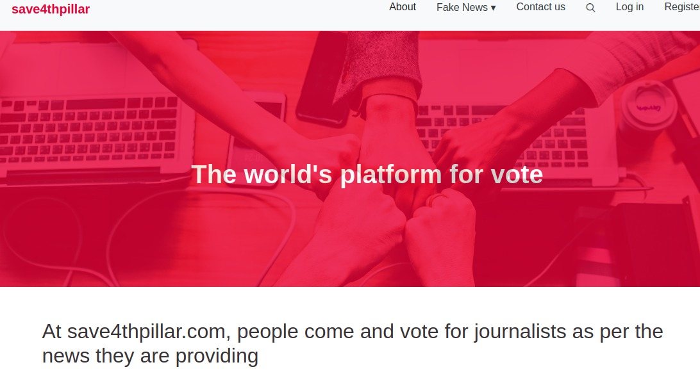
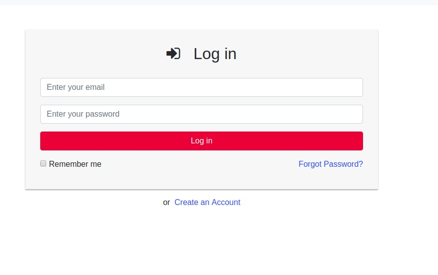
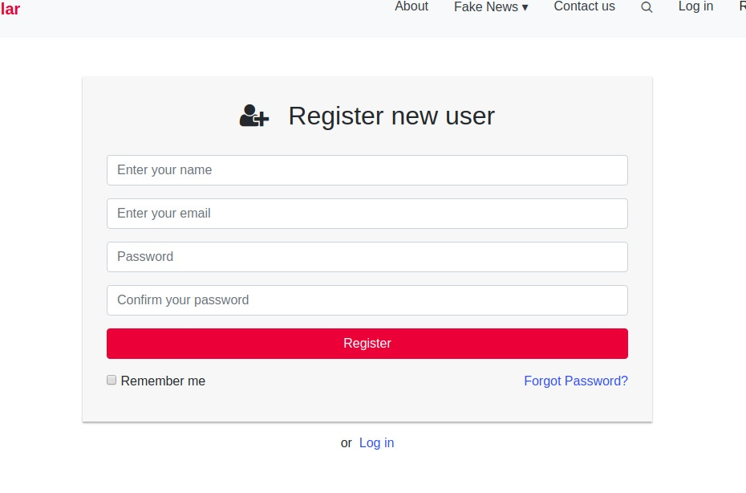
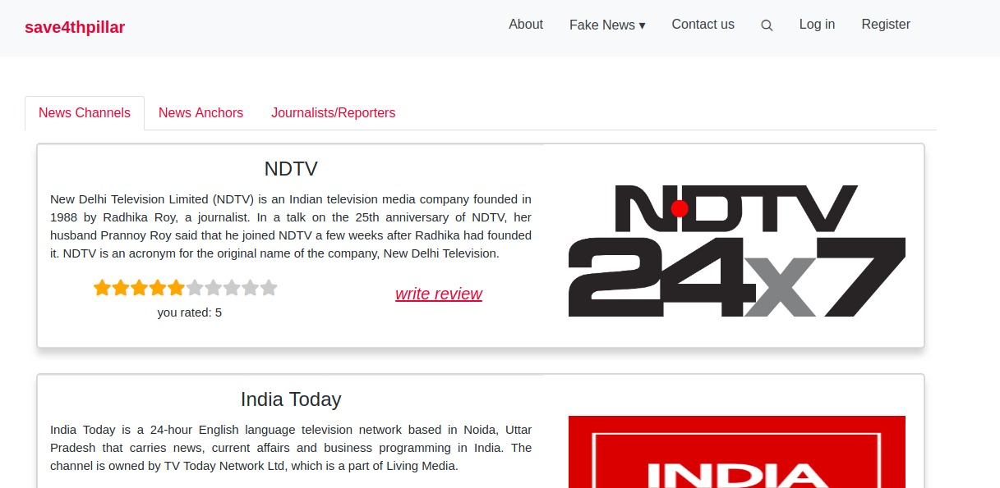
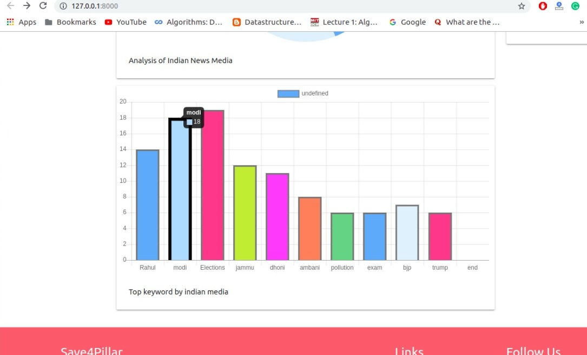
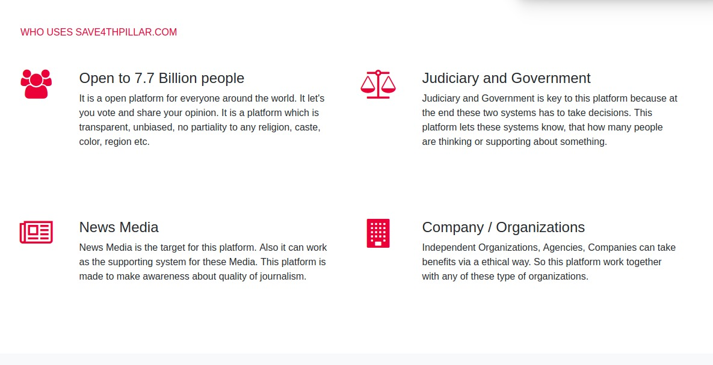
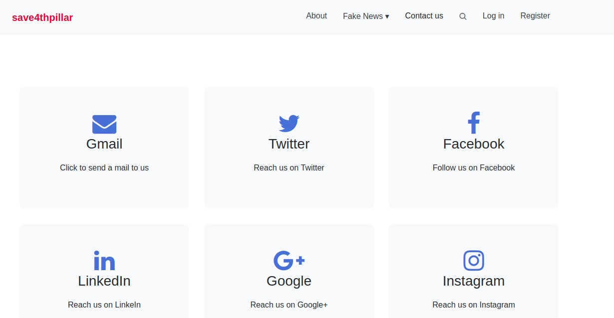
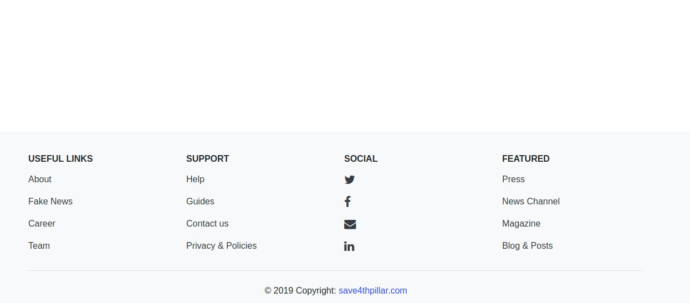

# Fourth-Pillar

In today‟s world News Channels are the leading source of representing each corner of the world but some of them are now going off track they talk less on crucial topics. We are going to make them feel how much they are diverted from the track. By categorizing their news, we give rank to the new channel. Our main aim of the project is to categorize News Channels on the basis of how much they talk on the main topics of our country and the whole world. We do it by scrapping news from the news channel and categorize its new on the basis of some selected topics and then we find number of times each news channel talks about a particular topic. Then we analyze the percentages and ranked them in each selected topic. We are doing it by using Scrapy for Web scrapping. Scrapy is a free and open-source framework for web- crawiling which is written in Python. It is originally designe for scraping the web, we can also use it to extract data using APIs or as a general- purpose web crawler tool. It is currently maintained by Scrapinghub Ltd., a web-scraping development and services company.

